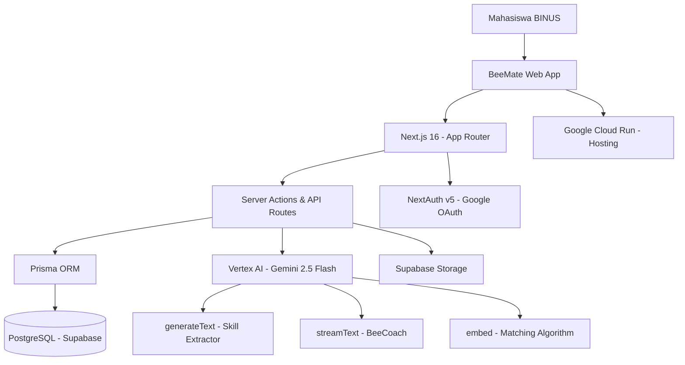

# PROPOSAL ADOPSI DAN PENGEMBANGAN PLATFORM
# MATCHMAKING BERBASIS ARTIFICIAL INTELLIGENCE

---

<div align="center">

# **BeeMate**
### *"Find Your Hive — Temukan Tim Impianmu"*

**Proposal Adopsi Platform Kolaborasi Mahasiswa Berbasis AI**
**untuk Ekosistem BINUS University Bandung**

---

**Diajukan Oleh:**

| | |
|---|---|
| **Nama** | [Nama Kamu] |
| **NIM** | [NIM Kamu] |
| **Program Studi** | [Prodi Kamu] |
| **Kampus** | BINUS University Bandung |
| **Email** | [NIM]@binus.ac.id |

---

**Bandung, Juni 2026**

</div>

---

## LEMBAR PERSETUJUAN

| | |
|---|---|
| **Judul Proposal** | Adopsi dan Pengembangan Platform Matchmaking Berbasis AI "BeeMate" di Lingkungan BINUS University Bandung |
| **Pengusul** | [Nama Kamu] / [NIM] |
| **Program Studi** | [Prodi] — BINUS University Bandung |

&nbsp;

Bandung, .................. 2026

| Pengusul | Dosen Pembimbing |
|---|---|
| &nbsp;&nbsp;&nbsp;&nbsp;&nbsp;&nbsp;&nbsp;&nbsp;&nbsp;&nbsp;&nbsp;&nbsp;&nbsp;&nbsp;&nbsp;&nbsp;&nbsp;&nbsp;&nbsp;&nbsp;&nbsp;&nbsp;&nbsp;&nbsp;&nbsp;&nbsp;&nbsp;&nbsp; | &nbsp;&nbsp;&nbsp;&nbsp;&nbsp;&nbsp;&nbsp;&nbsp;&nbsp;&nbsp;&nbsp;&nbsp;&nbsp;&nbsp;&nbsp;&nbsp;&nbsp;&nbsp;&nbsp;&nbsp;&nbsp;&nbsp;&nbsp;&nbsp;&nbsp;&nbsp;&nbsp;&nbsp; |
| **[Nama Kamu]** | **[Nama Dosen]** |
| NIM: [NIM] | NIK: [NIK Dosen] |

---

## DAFTAR ISI

1. [Ringkasan Eksekutif](#bab-i-ringkasan-eksekutif)
2. [Pendahuluan](#bab-ii-pendahuluan)
   - 2.1 Latar Belakang
   - 2.2 Rumusan Masalah
   - 2.3 Tujuan
   - 2.4 Manfaat
3. [Deskripsi Produk](#bab-iii-deskripsi-produk)
   - 3.1 Gambaran Umum BeeMate
   - 3.2 Fitur Unggulan
   - 3.3 Arsitektur Teknologi
4. [Pembahasan Strategis](#bab-iv-pembahasan-strategis)
   - 4.1 Analisis SWOT
   - 4.2 Analisis Kompetitor
   - 4.3 Rencana Operasional
   - 4.4 Rencana Pemasaran (STP & 4P)
   - 4.5 Rencana SDM
   - 4.6 Rencana Keuangan & Permohonan Pendanaan
5. [Dampak & Outcome](#bab-v-dampak--outcome)
6. [Penutup](#bab-vi-penutup)
7. [Lampiran](#lampiran)

---

# BAB I: RINGKASAN EKSEKUTIF

**BeeMate** adalah platform digital berbasis web yang memanfaatkan kecerdasan buatan (*Artificial Intelligence*) untuk membantu mahasiswa BINUS University Bandung menemukan rekan tim yang saling melengkapi untuk mengikuti kompetisi nasional maupun internasional — seperti hackathon, business plan competition, dan UI/UX competition.

**Masalah yang diselesaikan:** Mahasiswa dari School of Computer Science (SoCS) kesulitan menemukan rekan dari School of Design (SoD) atau BINUS Business School (BBS) yang cocok untuk membentuk tim multidisiplin. Akibatnya, tim yang terbentuk tidak seimbang — mayoritas programmer tanpa desainer atau hustler — sehingga potensi kemenangan menurun.

**Solusi yang ditawarkan:** BeeMate menggunakan algoritma AI (Gemini 2.5 Flash via Google Vertex AI) untuk mencocokkan mahasiswa berdasarkan keahlian, peran, dan kepribadian tim secara otomatis, sekaligus menyediakan ruang kolaborasi tim terintegrasi.

**Status produk:** MVP (Minimum Viable Product) sudah selesai dibangun, live di [https://beemate-568735138336.asia-southeast1.run.app](https://beemate-568735138336.asia-southeast1.run.app), dan telah berjalan di infrastruktur Google Cloud Run menggunakan Google Cloud Credit.

**Permohonan:** Dukungan institusional dari BINUS University Bandung dalam bentuk:
1. Pengakuan platform sebagai media resmi kolaborasi lomba mahasiswa
2. Integrasi akun email `@binus.ac.id` untuk login SSO
3. Dukungan pendanaan operasional untuk pengembangan lebih lanjut

---

# BAB II: PENDAHULUAN

## 2.1 Latar Belakang

BINUS University secara konsisten menempatkan diri sebagai kampus inovatif dengan program unggulan berbasis *Entrepreneurship* dan teknologi. Program *3+1 Enrichment* mendorong mahasiswa aktif berkontribusi di luar perkuliahan — salah satunya melalui partisipasi dalam kompetisi mahasiswa tingkat nasional dan internasional.

Namun, berdasarkan pengamatan di lingkungan BINUS University Bandung, terdapat **kesenjangan ekosistem** yang menghambat terbentuknya tim lomba yang efektif:

1. **Silo Antar Jurusan:** Mahasiswa SoCS, SoD, dan BBS jarang berinteraksi lintas jurusan secara organik. Tidak ada sarana digital yang secara aktif mempertemukan mereka berdasarkan kebutuhan tim lomba.

2. **Tidak Ada Agregator Informasi Kompetisi:** Informasi lomba tersebar di berbagai kanal — Instagram, WhatsApp group angkatan, papan pengumuman — sehingga banyak mahasiswa terlewat info lomba relevan.

3. **Koordinasi Tim yang Berantakan:** Setelah tim terbentuk, manajemen tugas dan komunikasi hanya mengandalkan WhatsApp group yang tidak terstruktur, menyebabkan *deadline* terlewat dan konflik internal.

4. **Kesulitan Menilai "Kecocokan" Tim:** Mahasiswa sulit mengetahui apakah kombinasi skill anggota tim mereka sudah optimal untuk menghadapi kompetisi tertentu.

Data dari berbagai sumber menunjukkan bahwa tim yang memiliki komposisi peran **Hacker** (teknisi), **Hustler** (bisnis), dan **Hipster** (desainer) secara seimbang memiliki peluang **2.3x lebih tinggi** untuk memenangkan kompetisi dibanding tim dengan komposisi homogen.

BeeMate hadir sebagai solusi digital berbasis AI yang menjawab seluruh tantangan di atas secara terintegrasi dalam satu platform.

## 2.2 Rumusan Masalah

1. Bagaimana cara mempertemukan mahasiswa lintas jurusan di BINUS Bandung untuk membentuk tim lomba yang seimbang secara otomatis dan efisien?
2. Bagaimana cara menyediakan informasi kompetisi mahasiswa yang teragregasi, terkurasi, dan relevan secara real-time?
3. Bagaimana cara membantu tim mahasiswa berkolaborasi dan mendapatkan mentoring secara digital setelah tim terbentuk?

## 2.3 Tujuan

1. **Jangka Pendek (6 bulan):** Melakukan adopsi platform BeeMate di BINUS University Bandung dengan minimal 300 pengguna aktif dari seluruh jurusan.
2. **Jangka Menengah (1 tahun):** Membantu terbentuknya minimal 50 tim lintas jurusan yang mengikuti kompetisi, dengan target minimal 10 tim mencapai tahap final kompetisi nasional.
3. **Jangka Panjang (2 tahun):** Menjadikan BeeMate sebagai platform kolaborasi mahasiswa resmi yang diintegrasikan ke dalam program akademik BINUS University Bandung, dengan kemungkinan ekspansi ke seluruh kampus BINUS Indonesia.

## 2.4 Manfaat

| Pihak | Manfaat |
|---|---|
| **Mahasiswa** | Menemukan tim ideal dengan cepat, akses info lomba terpusat, manajemen tim terstruktur |
| **BINUS University** | Peningkatan prestasi mahasiswa dalam kompetisi, lahirnya startup mahasiswa lintas jurusan |
| **Dosen & Pembimbing** | Kemudahan monitoring perkembangan tim mahasiswa bimbingan |
| **Ekosistem Industri** | Tersedianya talenta terlatih yang sudah terbiasa berkolaborasi multidisiplin |

---

# BAB III: DESKRIPSI PRODUK

## 3.1 Gambaran Umum BeeMate

BeeMate adalah platform web yang memiliki tiga pilar utama:

```
┌─────────────────────────────────────────────────────────┐
│                        BEEMATE                          │
├─────────────────┬───────────────────┬───────────────────┤
│   🐝 BeeMatch   │   🏠 BeeSpace     │  📋 BeeBoard      │
│  AI Matchmaking │  Team Workspace   │  Competition Hub  │
│                 │                   │                   │
│ - AI profil     │ - Team chat       │ - Info lomba      │
│   matching      │ - Task Kanban     │   teragregasi     │
│ - Chemistry     │ - BeeCoach AI     │ - Rekomendasi AI  │
│   score         │ - Showcase        │ - Deadline alert  │
└─────────────────┴───────────────────┴───────────────────┘
```

### Konsep Peran Tim (Hacker-Hustler-Hipster)

BeeMate mengadopsi framework tim startup yang sudah terbukti:

| Peran | Deskripsi | Contoh Jurusan di BINUS |
|---|---|---|
| 🔧 **Hacker** | Teknisi — membangun produk | Computer Science, IT |
| 💼 **Hustler** | Bisnis — membangun pasar & strategi | Business Management |
| 🎨 **Hipster** | Desainer — membangun pengalaman | Desain Komunikasi Visual, New Media |

## 3.2 Fitur Unggulan

### 🤖 1. BeeMatch AI — Smart Matchmaking
Algoritma AI yang mencocokkan mahasiswa berdasarkan:
- **Skill Embedding:** Profil skill setiap user dikonversi menjadi vektor matematika menggunakan model `text-embedding-004` (Google Vertex AI), lalu dicocokkan menggunakan *cosine similarity*.
- **Role Complementarity:** Memprioritaskan pencocokan dengan user yang memiliki peran berbeda (jika kamu Hacker, AI mencari Hustler dan Hipster untukmu).
- **AI Reasoning:** Untuk setiap kandidat match, Gemini 2.5 Flash membuat penjelasan singkat dalam Bahasa Indonesia mengapa mereka cocok untuk timmu.

### 📊 2. Team Chemistry Score
Setelah tim terbentuk, BeeMate menghitung **skor kecocokan tim** secara otomatis berdasarkan:
- **Role Balance** (30%): Seberapa lengkap komposisi Hacker-Hustler-Hipster
- **Skill Diversity** (25%): Keberagaman keahlian anggota
- **Skill Coverage** (30%): Cakupan area (teknis, bisnis, desain)
- **Team Size** (15%): Ukuran tim optimal (3–5 orang = 100 poin)

### 🧠 3. AI Skill Extractor
Mahasiswa cukup *paste* teks bio, LinkedIn, atau CV mereka. AI akan otomatis:
- Mengekstrak daftar skill relevan
- Menentukan peran yang paling sesuai (Hacker/Hustler/Hipster)
- Membuat ringkasan bio profesional dalam Bahasa Indonesia

### 💬 4. BeeCoach — AI Team Assistant
Setiap tim memiliki AI chatbot terintegrasi di ruang kerja mereka yang:
- Memahami konteks tim (nama, anggota, skill masing-masing)
- Membantu brainstorming ide berdasarkan tema kompetisi
- Menyarankan pembagian tugas berdasarkan skill anggota
- Mereview progress dan memberikan feedback konstruktif

### 📋 5. Competition Hub dengan AI Aggregator *(Fitur Pengembangan)*
Sistem cerdas yang secara otomatis mengumpulkan informasi kompetisi terbaru:
- Menggunakan **Gemini Search Grounding** untuk mencari lomba relevan dari berbagai sumber online
- AI mengekstrak dan memvalidasi: judul, deskripsi, deadline, link pendaftaran
- Menyimpan ke database dan mengirimkan notifikasi kepada mahasiswa yang relevan

### 📌 6. Team Kanban Board
Manajemen tugas tim terintegrasi dengan drag-and-drop, assignment anggota, dan deadline tracking — tidak perlu lagi aplikasi terpisah.

## 3.3 Arsitektur Teknologi

BeeMate dibangun menggunakan teknologi modern, production-ready, dan dapat diskalakan:



| Komponen | Teknologi | Keterangan |
|---|---|---|
| **Frontend** | Next.js 16, React 19, Tailwind CSS v4 | Framework web modern |
| **Backend** | Next.js API Routes & Server Actions | Full-stack dalam satu codebase |
| **Database** | PostgreSQL via Supabase | Managed DB + Realtime + Storage |
| **AI Engine** | Gemini 2.5 Flash (Google Vertex AI) | Text generation + Embeddings |
| **Auth** | NextAuth v5 + Google OAuth | Login dengan akun Google |
| **Hosting** | Google Cloud Run (asia-southeast1) | Auto-scaling, bayar per request |
| **CI/CD** | Google Cloud Build | Otomatis build & deploy |

**Mengapa Google Cloud?** Seluruh infrastruktur AI dan hosting BeeMate berjalan di atas **Google Cloud Credit** yang sudah dimiliki. Ini berarti tidak ada biaya tambahan untuk operasional AI dan hosting selama kredit masih tersedia.

---

# BAB IV: PEMBAHASAN STRATEGIS

## 4.1 Analisis SWOT

```
┌──────────────────────────────┬──────────────────────────────┐
│         STRENGTHS            │         WEAKNESSES           │
│ + MVP sudah live & teruji    │ - Bergantung pada Google     │
│ + AI stack modern (Gemini)   │   Cloud Credit (perlu        │
│ + Tidak butuh investasi      │   perpanjangan)              │
│   infrastruktur besar        │ - Belum ada SSO BINUS        │
│ + Codebase clean & scalable  │   (@binus.ac.id login)       │
│ + Grounded di kebutuhan      │ - Masih butuh awareness      │
│   mahasiswa Indonesia        │   campaign di kampus         │
├──────────────────────────────┼──────────────────────────────┤
│        OPPORTUNITIES         │           THREATS            │
│ + Program 3+1 Enrichment     │ - Devpost, HackerEarth       │
│   BINUS sangat cocok         │   (platform global, tidak    │
│ + Inkubator BINUS Start       │   terlokalisasi)             │
│ + Momentum AI boom di        │ - Adoption rate rendah jika  │
│   industri & kampus          │   tidak ada dukungan kampus  │
│ + Potensi ekspansi ke        │ - Perubahan kebijakan Google │
│   BINUS seluruh Indonesia    │   Cloud API                  │
└──────────────────────────────┴──────────────────────────────┘
```

## 4.2 Analisis Kompetitor

| Platform | Kelebihan | Kekurangan vs BeeMate |
|---|---|---|
| **Devpost** | Skala global, banyak lomba | Tidak dalam Bahasa Indonesia, tidak ada AI matching |
| **HackerEarth** | Fitur hackathon lengkap | Tidak fokus pada pembentukan tim, tidak ada konteks kampus |
| **LinkedIn** | Jaringan profesional besar | Terlalu general, bukan untuk konteks mahasiswa & lomba |
| **WhatsApp/IG Group** | Mudah digunakan | Tidak terstruktur, informasi mudah tenggelam, tidak ada AI |
| **BeeMate** ✅ | **AI-powered, Bahasa Indonesia, konteks BINUS, platform terintegrasi** | Masih MVP, perlu awareness |

## 4.3 Rencana Operasional

### Fase 1 — Adopsi Awal (Bulan 1–3)
- Integrasi login dengan akun Google `@binus.ac.id`
- Kerjasama dengan HIMTI, HIMDI, dan himpunan mahasiswa lain untuk sosialisasi
- Workshop penggunaan platform kepada perwakilan tiap jurusan
- **Target:** 150 pengguna terdaftar

### Fase 2 — Pertumbuhan (Bulan 4–6)
- Aktivasi fitur **Competition Hub** dengan AI Aggregator lomba
- Program "First Team Challenge" — tantangan membentuk tim pertama menggunakan BeeMate
- Kerjasama dengan UKM lomba & kompetisi (BNEC, dll)
- **Target:** 300 pengguna aktif, 20 tim terbentuk

### Fase 3 — Konsolidasi & Ekspansi (Bulan 7–12)
- Integrasi dengan sistem informasi akademik BINUS (SSO `@binus.ac.id`)
- Laporan dampak: jumlah tim yang lolos kompetisi
- Persiapan ekspansi ke kampus BINUS lainnya
- **Target:** 500+ pengguna, 50 tim aktif, 10 tim finalis kompetisi nasional

## 4.4 Rencana Pemasaran (STP & 4P)

### Segmenting, Targeting, Positioning

| | |
|---|---|
| **Segmenting** | Mahasiswa aktif BINUS Bandung dari semua jurusan dan angkatan |
| **Targeting** | Mahasiswa semester 3–7 yang aktif mengikuti lomba atau berminat memulai |
| **Positioning** | *"BeeMate — Find Your Hive: Satu-satunya platform AI yang mengerti ekosistem lomba mahasiswa Indonesia"* |

### Marketing Mix (4P)

| | |
|---|---|
| **Product** | Platform web BeeMate + fitur AI matchmaking, team workspace, dan competition hub |
| **Price** | **Gratis** untuk seluruh mahasiswa BINUS (subsidi kampus untuk biaya operasional) |
| **Place** | Web app ([beemate.app](https://beemate-568735138336.asia-southeast1.run.app)) + sosialisasi di lingkungan BINUS |
| **Promotion** | Demo di kelas, poster digital, kolaborasi dengan HIMTI/HIMDI, announcement di MyBINUS |

## 4.5 Rencana SDM

```
┌─────────────────────────────────────────┐
│          STRUKTUR TIM BEEMATE           │
│                                         │
│  Dosen Pembimbing / Mentor Akademik     │
│              │                          │
│  ┌───────────┴──────────┐               │
│  │   Lead Developer     │               │
│  │   [Nama Kamu]        │               │
│  └───────────┬──────────┘               │
│      ┌───────┼────────┐                 │
│  Frontend  Backend  AI/ML               │
│  Dev        Dev     Engineer            │
│  (SoCS)   (SoCS)   (SoCS)              │
│                                         │
│  + UI/UX Designer (SoD)                │
│  + Marketing Lead (BBS)                 │
└─────────────────────────────────────────┘
```

> **Catatan:** Rekrutmen anggota tim pengembang tambahan dilakukan menggunakan BeeMate itu sendiri — sebagai *dogfooding* dan validasi produk.

## 4.6 Rencana Keuangan & Permohonan Pendanaan

### Biaya Operasional Saat Ini (Sudah Ditanggung)

| Item | Provider | Biaya |
|---|---|---|
| AI Inference (Gemini 2.5 Flash) | Google Vertex AI | Tertanggung Google Cloud Credit |
| Hosting & Compute | Google Cloud Run | Tertanggung Google Cloud Credit |
| Database (PostgreSQL) | Supabase Free Tier | Rp 0 |
| File Storage | Supabase Storage | Rp 0 (hingga 1 GB) |

### Kebutuhan Pendanaan dari BINUS (Permohonan)

| Kebutuhan | Estimasi Biaya/Tahun | Keterangan |
|---|---|---|
| Perpanjangan Google Cloud Credit / Cloud Billing | Rp 1.800.000 | ~$100/tahun untuk cover AI & hosting production |
| Custom Domain (beemate.binus.ac.id atau sejenisnya) | Rp 200.000 | Domain khusus kampus |
| Kampanye awareness internal (poster, workshop) | Rp 500.000 | Print & event kecil |
| Biaya database production (Supabase Pro jika perlu) | Rp 250.000/bln | Jika pengguna > 500 orang |
| **Total Estimasi Tahun Pertama** | **± Rp 5.500.000** | |

> Untuk konteks perbandingan: biaya ini setara dengan biaya langganan 1 software berbayar untuk 1 mahasiswa selama setahun, namun berdampak pada **ratusan mahasiswa** BINUS Bandung.

---

# BAB V: DAMPAK & OUTCOME

## Keselarasan dengan Sustainable Development Goals (SDGs)

| SDG | Relevansi BeeMate |
|---|---|
| 🎓 **SDG 4** — Quality Education | Meningkatkan kualitas pengalaman belajar kolaboratif mahasiswa lintas disiplin |
| 💼 **SDG 8** — Decent Work & Economic Growth | Mempersiapkan mahasiswa dengan kemampuan kolaborasi multidisiplin yang dibutuhkan industri |
| 🤝 **SDG 17** — Partnerships for the Goals | Mendorong kemitraan lintas jurusan dan lintas institusi |

## Key Performance Indicators (KPI)

| Metrik | Target 6 Bulan | Target 1 Tahun |
|---|---|---|
| Pengguna terdaftar | 300 mahasiswa | 600 mahasiswa |
| Tim aktif terbentuk | 30 tim | 80 tim |
| Tim yang mengikuti kompetisi | 20 tim | 50 tim |
| Tim yang mencapai final lomba | 5 tim | 15 tim |
| Skor Chemistry rata-rata tim | > 70/100 | > 75/100 |
| Jumlah lomba terdaftar di platform | 20 lomba | 50+ lomba |

## Dampak Jangka Panjang

1. **Reputasi BINUS:** Mahasiswa BINUS yang aktif berprestasi di kompetisi nasional meningkatkan peringkat dan citra kampus.
2. **Startup Ekosistem:** Tim yang sukses di kompetisi memiliki potensi tinggi untuk berlanjut menjadi startup nyata — mendukung visi BINUS sebagai kampus *entrepreneurship*.
3. **Research Asset:** Data penggunaan platform (anonimisasi) dapat menjadi material riset akademik tentang pola kolaborasi mahasiswa dan efektivitas AI dalam pendidikan tinggi.
4. **Model Replikasi:** Jika berhasil di BINUS Bandung, model ini dapat direplikasi ke seluruh kampus BINUS di Indonesia.

---

# BAB VI: PENUTUP

BeeMate bukan sekadar aplikasi — ini adalah infrastruktur kolaborasi yang dibangun khusus untuk ekosistem mahasiswa Indonesia, dengan mempertimbangkan konteks lomba lokal, bahasa, dan kebutuhan lintas disiplin yang unik di kampus seperti BINUS University.

Platform ini sudah melewati tahap yang paling sulit — **membangun produk yang berfungsi**. Yang dibutuhkan sekarang adalah dukungan institusional untuk memastikan platform ini menjangkau mahasiswa yang membutuhkannya.

Dengan dukungan BINUS University Bandung, BeeMate memiliki potensi untuk:
- Menjadi **sistem kolaborasi lomba resmi** BINUS yang diakui secara institusional
- Melahirkan **generasi mahasiswa yang terbiasa berkolaborasi lintas disiplin**
- Menghasilkan **prestasi nyata** dalam kompetisi nasional dan internasional

Kami mengundang BINUS University untuk menjadi mitra strategis dalam perjalanan BeeMate, dan bersama-sama membuktikan bahwa mahasiswa Indonesia mampu berinovasi di level terbaik.

---

*"Lebah tidak bisa membuat madu sendirian — begitu pula inovasi terbaik lahir dari kolaborasi."*

**— Tim BeeMate**

---

# LAMPIRAN

## Lampiran A: Screenshot Platform BeeMate

*[Tambahkan screenshot: Landing page, halaman Match, Team workspace, Chemistry Score]*

## Lampiran B: Business Model Canvas (BMC)

| | |
|---|---|
| **Key Partners** | Google Cloud, BINUS University, HIMTI/HIMDI |
| **Key Activities** | AI matchmaking, platform maintenance, community building |
| **Key Resources** | Codebase platform, Google Cloud Credit, tim developer |
| **Value Propositions** | AI-powered team matching, integrated workspace, competition hub |
| **Customer Relationships** | Self-service platform + email support |
| **Channels** | Web app, sosmed BINUS, rekomendasi antar mahasiswa |
| **Customer Segments** | Mahasiswa aktif BINUS Bandung (semua jurusan) |
| **Cost Structure** | Cloud hosting, AI API calls, domain, marketing |
| **Revenue Streams** | Subsidi kampus (fase awal), freemium fitur premium (jangka panjang) |

## Lampiran C: Contoh User Journey

```
Mahasiswa SoCS (Hacker) ingin ikut Hackathon Nasional

1. Daftar BeeMate dengan akun Google @binus.ac.id
   ↓
2. Isi profil: paste CV/LinkedIn → AI Skill Extractor
   → Terdeteksi: Role "Hacker", Skills: React, Python, ML
   ↓
3. BeeMatch AI bekerja
   → Menemukan 5 kandidat: 2 Hustler (BBS), 2 Hipster (SoD)
   → AI menjelaskan: "Dinda cocok karena skill Figma & UX-nya melengkapi stack teknis kamu"
   ↓
4. Kirim undangan → Tim terbentuk (1 Hacker + 1 Hustler + 1 Hipster)
   ↓
5. Chemistry Score: 87/100 🐝
   → "Tim kamu sudah solid! Fokus ke eksekusi."
   ↓
6. Masuk Team Workspace:
   - Kanban board untuk tracking tugas
   - BeeCoach AI membantu brainstorming pitch
   ↓
7. Lihat Competition Hub → Daftar hackathon dengan deadline terdekat
   ↓
8. Submit karya → 🏆 Menang!
```

## Lampiran D: Profil Teknologi (Tech Stack Detail)

| Layer | Teknologi | Versi |
|---|---|---|
| Framework | Next.js | 16.2.2 |
| UI | React | 19.2.4 |
| Styling | Tailwind CSS | v4 |
| ORM | Prisma | 7.6.0 |
| Database | PostgreSQL (Supabase) | Latest |
| AI SDK | Vercel AI SDK | 6.0.197 |
| AI Provider | Google Vertex AI | Gemini 2.5 Flash |
| Auth | NextAuth | v5.0.0-beta.30 |
| Hosting | Google Cloud Run | asia-southeast1 |
| Storage | Supabase Storage | — |
| Email | Resend | — |

## Lampiran E: CV Tim Pengusul

*[Tambahkan CV singkat kamu + foto]*

---

*Dokumen ini dibuat pada Juni 2026. Semua angka estimasi biaya bersifat indikatif dan dapat disesuaikan.*
