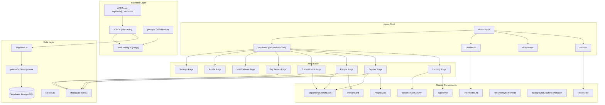
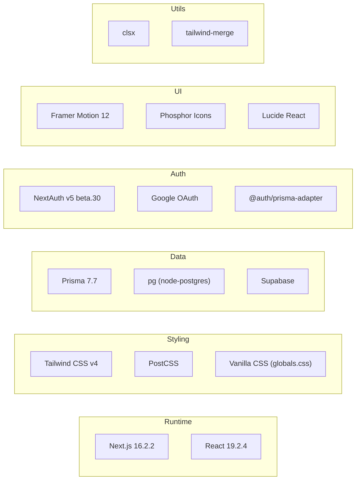
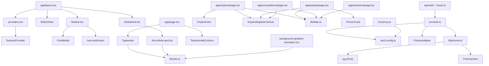
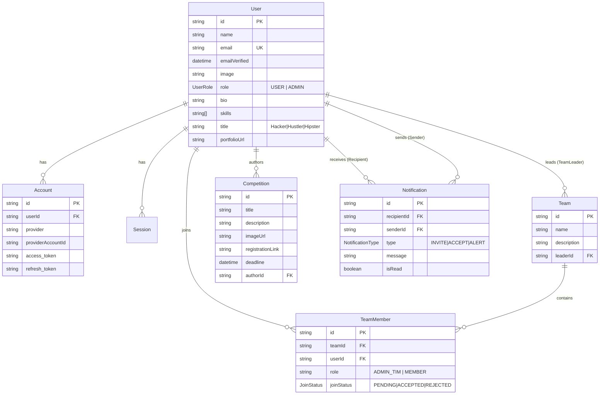
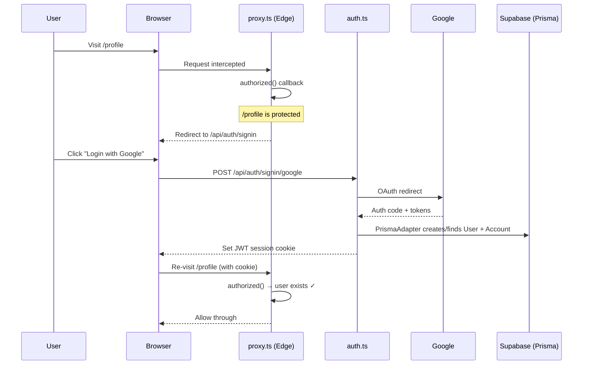
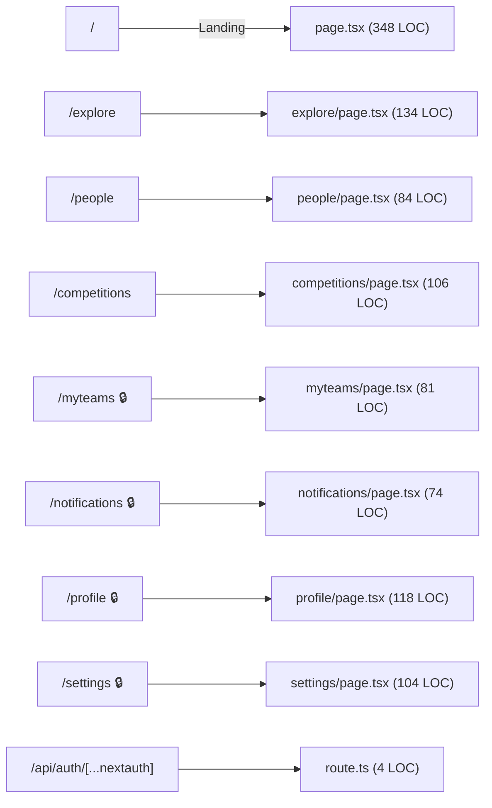

# 🐝 BeeMate — Deep Graphify Wiki

> **Generated**: 2026-05-01 · **Mode**: Deep · **Files Analyzed**: 33 source files · **Total LOC**: ~5,800+

---

## 📋 Table of Contents

1. [Project Overview](#project-overview)
2. [Architecture Diagram](#architecture-diagram)
3. [Technology Stack](#technology-stack)
4. [File Graph & Dependencies](#file-graph--dependencies)
5. [Directory Structure](#directory-structure)
6. [Data Layer](#data-layer)
7. [Authentication System](#authentication-system)
8. [Routing & Pages](#routing--pages)
9. [Component Catalog](#component-catalog)
10. [Design System](#design-system)
11. [Dependency Matrix](#dependency-matrix)
12. [Development Status](#development-status)
13. [Risk & Debt Analysis](#risk--debt-analysis)

---

## Project Overview

**BeeMate** is a campus matchmaking platform exclusively for Binusian (BINUS University students). It enables students to find competition partners, co-founders, and team members across departments — eliminating ghosting and unserious collaboration.

| Attribute | Value |
|---|---|
| **Framework** | Next.js 16.2.2 (App Router) |
| **Language** | TypeScript 5 |
| **Styling** | Tailwind CSS v4 + Vanilla CSS (2,700+ lines) |
| **Database** | PostgreSQL (Supabase) via Prisma 7 |
| **Auth** | Auth.js / NextAuth v5 (Google OAuth) |
| **UI Motion** | Framer Motion 12 |
| **Icons** | Phosphor Icons (web + react) |
| **State** | React `useState` (no global store) |

---

## Architecture Diagram



---

## Technology Stack



### Dependency Table

| Package | Version | Purpose |
|---|---|---|
| `next` | 16.2.2 | App framework |
| `react` / `react-dom` | 19.2.4 | UI library |
| `next-auth` | 5.0.0-beta.30 | Authentication |
| `@auth/prisma-adapter` | 2.11.1 | Auth ↔ Prisma bridge |
| `@prisma/client` | 7.7.0 | ORM client |
| `@prisma/adapter-pg` | 7.7.0 | PostgreSQL driver adapter |
| `pg` | 8.20.0 | Node PostgreSQL driver |
| `framer-motion` | 12.38.0 | Animations |
| `@phosphor-icons/react` | 2.1.10 | Icon library |
| `lucide-react` | 1.7.0 | Icons (search/X) |
| `clsx` | 2.1.1 | Classname merging |
| `tailwind-merge` | 3.5.0 | TW class dedup |
| `tailwindcss` | 4.x | CSS framework |

---

## File Graph & Dependencies

### Import Dependency Graph



### Node Connectivity Table

| File | Imports From | Imported By | Connectivity Score |
|---|---|---|---|
| `lib/data.ts` | 0 | 4 pages | ⭐⭐⭐⭐⭐ Hub |
| `lib/utils.ts` | 2 (clsx, tw-merge) | 3 components | ⭐⭐⭐ |
| `lib/prisma.ts` | 3 (pg, adapter, client) | 1 (auth.ts) | ⭐⭐ |
| `auth.config.ts` | 1 (next-auth) | 2 (auth.ts, proxy.ts) | ⭐⭐⭐ |
| `auth.ts` | 3 | 1 (route.ts) | ⭐⭐ |
| `Navbar.tsx` | 4 | 1 (layout) | ⭐⭐ |
| `ExpandingSearchDock` | 3 | 3 pages | ⭐⭐⭐⭐ |
| `PostModal.tsx` | 1 | 1 (Navbar) | ⭐ |

---

## Directory Structure

```
beemate-app/
├── prisma/
│   └── schema.prisma          # 161 lines — 7 models, 3 enums
├── prisma.config.ts            # Prisma datasource config
├── src/
│   ├── auth.ts                 # NextAuth main config + PrismaAdapter
│   ├── auth.config.ts          # Edge-safe auth config (route protection)
│   ├── proxy.ts                # Edge middleware (replaces middleware.ts)
│   ├── app/
│   │   ├── layout.tsx          # Root layout (fonts, nav, providers)
│   │   ├── page.tsx            # Landing page (348 lines)
│   │   ├── globals.css         # Master stylesheet (2,704 lines)
│   │   ├── api/auth/[...nextauth]/route.ts  # Auth API handler
│   │   ├── explore/page.tsx    # Project board (134 lines)
│   │   ├── people/page.tsx     # People directory (84 lines)
│   │   ├── competitions/page.tsx # Competitions listing (106 lines)
│   │   ├── myteams/page.tsx    # Team management (81 lines)
│   │   ├── notifications/page.tsx # Notification center (74 lines)
│   │   ├── profile/page.tsx    # User profile (118 lines)
│   │   └── settings/page.tsx   # Settings panel (104 lines)
│   ├── components/
│   │   ├── auth/
│   │   │   └── login-button.tsx
│   │   ├── cards/
│   │   │   ├── PersonCard.tsx   # People card
│   │   │   └── ProjectCard.tsx  # Project card
│   │   ├── layout/
│   │   │   ├── Navbar.tsx       # Top navigation (226 lines)
│   │   │   ├── BottomNav.tsx    # Mobile bottom nav
│   │   │   └── providers.tsx    # SessionProvider wrapper
│   │   └── ui/
│   │       ├── ExpandingSearchDock.tsx  # Animated search (157 lines)
│   │       ├── GlobalGrid.tsx          # Grid wrapper
│   │       ├── HeroHoneycombNode.tsx   # SVG honeycomb animation
│   │       ├── PostModal.tsx           # Create post modal (175 lines)
│   │       ├── TestimonialsColumn.tsx   # Scrolling testimonials
│   │       ├── background-gradient-animation.tsx  # Gradient orbs
│   │       ├── the-infinite-grid.tsx   # Animated background grid
│   │       └── typewriter.tsx          # Typewriter text effect
│   └── lib/
│       ├── data.ts             # Mock data (Projects, People, Competitions, Teams)
│       ├── prisma.ts           # Prisma client singleton
│       └── utils.ts            # cn() helper
├── package.json
├── next.config.ts
├── tsconfig.json
├── eslint.config.mjs
└── postcss.config.mjs
```

---

## Data Layer

### Database Schema (Entity-Relationship)



### Mock Data Summary (lib/data.ts)

| Type | Count | Key Fields |
|---|---|---|
| `Project` | 9 | id, type, title, desc, needs[], open[], poster, deadline, urgent |
| `Person` | 12 | id, name, major, campus, skills[], score, status |
| `Competition` | 4 | id, title, org, deadline, tags[], type |
| `TeamItem` | 2 | id, title, role, members[], status |

> [!WARNING]
> All pages currently consume **mock data** from `lib/data.ts`. No page fetches from the database yet. The Prisma schema is defined but the transition to live data is incomplete.

---

## Authentication System



### Auth Architecture (Split Config Pattern)

| File | Runtime | Purpose |
|---|---|---|
| `auth.config.ts` | **Edge** | Google provider + `authorized()` callback. No Node.js deps. |
| `auth.ts` | **Node.js** | Full NextAuth with PrismaAdapter, JWT + session callbacks. |
| `proxy.ts` | **Edge** | Replaces `middleware.ts`. Uses edge-safe `authConfig` only. |
| `route.ts` | **Node.js** | API route handler exporting `{ GET, POST }` from `auth.ts`. |

### Protected Routes

| Route | Protected? | Redirect |
|---|---|---|
| `/` | ❌ | — |
| `/explore` | ❌ | — |
| `/people` | ❌ | — |
| `/competitions` | ❌ | — |
| `/profile` | ✅ | `/api/auth/signin` |
| `/settings` | ✅ | `/api/auth/signin` |
| `/myteams` | ✅ | `/api/auth/signin` |
| `/notifications` | ✅ | `/api/auth/signin` |
| `/api/auth/*` | ❌ (always allowed) | — |

---

## Routing & Pages

### Page Map



### Page Detail

| Route | Component | Rendering | Data Source | Features |
|---|---|---|---|---|
| `/` | `LandingPage` | CSR | Inline | Hero + typewriter, marquee, features grid, testimonials, CTA |
| `/explore` | `ExplorePage` | CSR | `PROJECTS` mock | Sidebar filters, search, project grid with cards |
| `/people` | `PeoplePage` | CSR | `PEOPLE` mock | Major filter, search, person grid with invite |
| `/competitions` | `CompetitionsPage` | CSR | `COMPETITIONS` mock | Search, animated cards with hover effects |
| `/myteams` | `MyTeamsPage` | CSR | `MY_TEAMS` mock | Team list, member avatars, "Create Team" CTA |
| `/notifications` | `NotificationsPage` | CSR | Inline mock | Notification types: invite, accept, system |
| `/profile` | `ProfilePage` | CSR | Hardcoded | Banner, tabs (portfolio/reviews), stats sidebar |
| `/settings` | `SettingsPage` | CSR | Hardcoded | Tab nav: account, appearance, notifications, privacy |

> [!NOTE]
> **All pages are `"use client"`** — no Server Components are used for page content. The root `layout.tsx` is the only Server Component.

---

## Component Catalog

### Layout Components

| Component | File | LOC | Props | Description |
|---|---|---|---|---|
| `Navbar` | `layout/Navbar.tsx` | 226 | — | Fixed top nav with logo, pills, icons, auth state, mobile menu |
| `BottomNav` | `layout/BottomNav.tsx` | 29 | — | Mobile-only fixed bottom nav (5 items) |
| `Providers` | `layout/providers.tsx` | 8 | `children` | Wraps app in `SessionProvider` |

### Card Components

| Component | File | LOC | Props | Description |
|---|---|---|---|---|
| `ProjectCard` | `cards/ProjectCard.tsx` | 32 | `project`, `onClick`, `onApply` | Project listing card with badge, tags, apply button |
| `PersonCard` | `cards/PersonCard.tsx` | 30 | `person`, `onInvite` | Person card with avatar, skills, score, invite button |

### UI Components

| Component | File | LOC | Props | Description |
|---|---|---|---|---|
| `ExpandingSearchDock` | `ui/ExpandingSearchDock.tsx` | 157 | `value`, `onChange`, `placeholder` | Animated icon → input search bar |
| `PostModal` | `ui/PostModal.tsx` | 175 | `isOpen`, `onClose` | Modal with 2 posting options (Find Team / LFG) |
| `Typewriter` | `ui/typewriter.tsx` | 121 | `text`, `speed`, `deleteSpeed`, etc. | Animated typing effect with cursor |
| `TestimonialsColumn` | `ui/TestimonialsColumn.tsx` | 97 | `testimonials`, `duration`, `className` | Infinite vertical scroll testimonial cards |
| `GlobalGrid` | `ui/GlobalGrid.tsx` | 8 | — | Thin wrapper around `TheInfiniteGrid` |
| `TheInfiniteGrid` | `ui/the-infinite-grid.tsx` | 93 | — | Animated SVG grid background with mouse tracking |
| `HeroHoneycombNode` | `ui/HeroHoneycombNode.tsx` | 145 | — | SVG hexagonal network animation (unused) |
| `BackgroundGradientAnimation` | `ui/background-gradient-animation.tsx` | 186 | Many color props | Gradient orb animation layer (unused) |

---

## Design System

### Color Tokens

| Token | Hex | Usage |
|---|---|---|
| `--ho` | `#f5a623` | 🟡 Honey — Primary accent |
| `--ho2` | `#ffbe4d` | 🟡 Honey light |
| `--bl` | `#5b9cf6` | 🔵 Blue — Secondary |
| `--gn` | `#2dd67a` | 🟢 Green — Success |
| `--rd` | `#f96b6b` | 🔴 Red — Danger |
| `--pu` | `#a78bfa` | 🟣 Purple — Accent |
| `--or` | `#fb923c` | 🟠 Orange |
| `--bg` | `#0f1117` | Dark base |
| `--t` | `#f2f4fc` | Primary text |
| `--t2` | `#a8b0d0` | Secondary text |
| `--t3` | `#636d9a` | Muted text |

### Typography

| Font | Variable | Usage |
|---|---|---|
| Sora | `--font-sora` | Headlines, brand text |
| Plus Jakarta Sans | `--font-jakarta` | UI labels |
| JetBrains Mono | `--font-jetbrains` | Badges, monospace |

### Component Classes

| Class | Description |
|---|---|
| `.btn-honey` | Primary CTA (gradient gold) |
| `.btn-dark` | Secondary (dark surface) |
| `.btn-ghost` | Tertiary (transparent) |
| `.btn-{xs,sm,md,lg,xl}` | Size variants |
| `.bdg-{h,b,g,r,p,or}` | Colored badges |
| `.chip` / `.chip.on` | Filter chips |
| `.av` / `.av-{20..80}` | Avatar circles |
| `.status-open` / `.status-busy` | Status pills |

### Globals.css Breakdown (2,704 lines)

| Section | Lines | Description |
|---|---|---|
| Tailwind import + theme | 1–43 | Keyframe animations |
| Reset + CSS Variables | 44–98 | Color tokens, easing, radii, shadows |
| Navigation | 100–150 | Fixed navbar, pills, icons, avatar |
| Layout Shell | 151–190 | Grid layout, sidebar, main area |
| Buttons & Badges | 191–248 | btn variants, badges, status, chips |
| Avatars & Cards | 249–310 | Avatar sizes, card base styles |
| Landing Page | 310–495 | Hero, marquee, features, testimonials, CTA |
| Explore / Projects | 496–560 | Project card styles |
| People | 563–640 | Person card, invite button |
| Profile | 593–650 | Cover, stats, portfolio |
| Other Pages | 650–810 | Competitions, teams, notifications, settings |
| Responsive | 813–860 | Breakpoints, mobile bottom nav |
| Light Theme | 860–970 | Theme overrides |
| Bento Grid | 990+ | Additional layout patterns |

---

## Dependency Matrix

### Which files depend on what:

| Source File | `framer-motion` | `next-auth` | `lib/data` | `lib/utils` | `lucide-react` |
|---|---|---|---|---|---|
| `app/page.tsx` | ✅ | — | — | — | — |
| `app/explore/page.tsx` | — | — | ✅ | — | — |
| `app/people/page.tsx` | — | — | ✅ | — | — |
| `app/competitions/page.tsx` | ✅ | — | ✅ | — | — |
| `app/myteams/page.tsx` | ✅ | — | ✅ | — | — |
| `app/notifications/page.tsx` | ✅ | — | — | — | — |
| `app/profile/page.tsx` | ✅ | — | — | — | — |
| `app/settings/page.tsx` | ✅ | — | — | — | — |
| `Navbar.tsx` | ✅ | ✅ | — | — | — |
| `ExpandingSearchDock.tsx` | ✅ | — | — | — | ✅ |
| `typewriter.tsx` | ✅ | — | — | ✅ | — |
| `the-infinite-grid.tsx` | ✅ | — | — | ✅ | — |

---

## Development Status

### Master Plan Progress

| Phase | Status | Description |
|---|---|---|
| **Tahap 1**: Database Setup | ✅ Done | Supabase + Prisma schema defined |
| **Tahap 2**: Google Auth | ✅ Done | NextAuth v5, Google OAuth, edge-safe proxy |
| **Tahap 3**: Profile CRUD | 🟡 Partial | UI exists, no Server Actions for DB writes |
| **Tahap 4**: People Directory | 🟡 Partial | UI + filter done, still uses mock data |
| **Tahap 5**: Team Features | 🔴 Not Started | Mock teams only, no invite/accept flow |
| **Tahap 6**: Admin & Competitions | 🔴 Not Started | No RBAC, admin dashboard not built |
| **Tahap 7**: Polish & Deploy | 🔴 Not Started | No file upload, no production deploy |

### Unused Components

| Component | Status | Notes |
|---|---|---|
| `HeroHoneycombNode.tsx` | ⚠️ Not imported by any page | Available for future use |
| `BackgroundGradientAnimation.tsx` | ⚠️ Not imported by any page | Available for future use |
| `login-button.tsx` | ⚠️ Not verified | In `components/auth/` |

---

## Risk & Debt Analysis

### 🔴 Critical Issues

| # | Issue | Impact | Location |
|---|---|---|---|
| 1 | **All data is mock** — no page reads from DB | App non-functional for real users | All pages |
| 2 | **No Server Actions** — profile edits don't persist | Users can't update their data | `/profile`, `/settings` |
| 3 | **No RBAC enforcement** — admin role exists in schema but not checked | Any user could potentially access admin features | Schema vs. UI gap |

### 🟡 Technical Debt

| # | Issue | Impact | Location |
|---|---|---|---|
| 4 | All pages are `"use client"` | Misses SSR/SSG benefits, larger JS bundles | All `page.tsx` |
| 5 | `globals.css` is 2,704 lines monolith | Hard to maintain, high specificity conflicts | `globals.css` |
| 6 | Hardcoded profile data ("Raka Kusuma") | Profile page doesn't reflect logged-in user | `profile/page.tsx` |
| 7 | `alert()` used for interactions | Placeholder UX, no real modal/action system | Explore, People |
| 8 | No error boundaries | Unhandled errors crash entire app | Global |
| 9 | No loading states / Suspense | Poor perceived performance | All pages |
| 10 | Inline styles mixed with CSS classes | Inconsistent styling approach | Most components |

### 🟢 Strengths

| # | Strength | Details |
|---|---|---|
| 1 | **Robust auth architecture** | Edge-safe split config avoids crypto errors |
| 2 | **Rich design system** | Comprehensive CSS variables, responsive breakpoints |
| 3 | **Polished UI animations** | Framer Motion used extensively with good timing |
| 4 | **Well-defined DB schema** | Prisma schema covers all planned features |
| 5 | **Mobile-responsive** | Bottom nav, responsive grid, mobile menu |
| 6 | **Theme support** | Dark/light mode with CSS variables |

---

> [!TIP]
> **Next Steps Priority**: Tahap 3 (Profile CRUD with Server Actions) → Tahap 4 (People from DB) → Tahap 5 (Team invite flow). These unlock the core value proposition of the platform.
